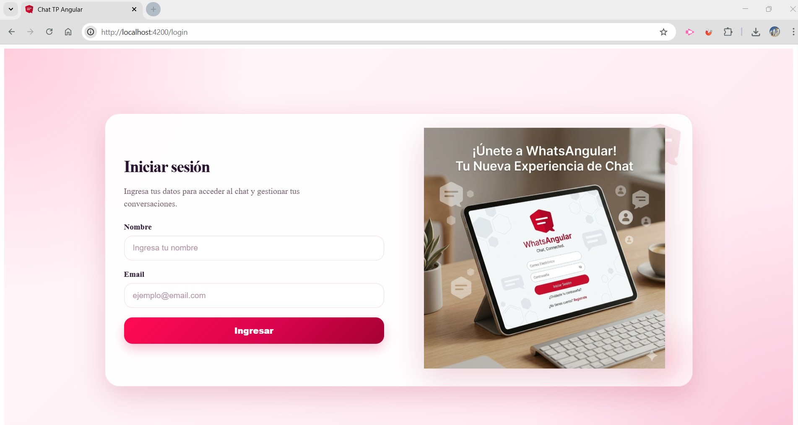
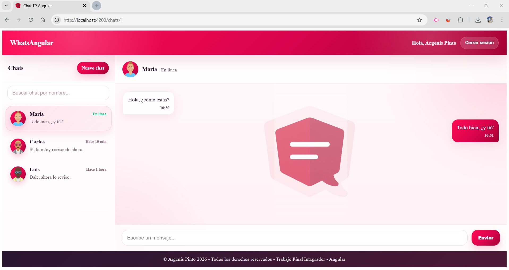
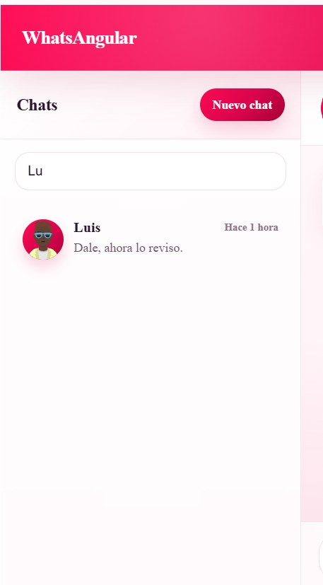
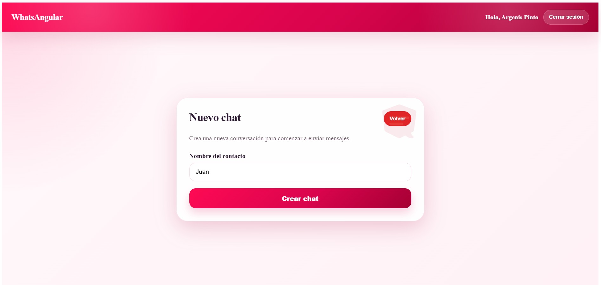
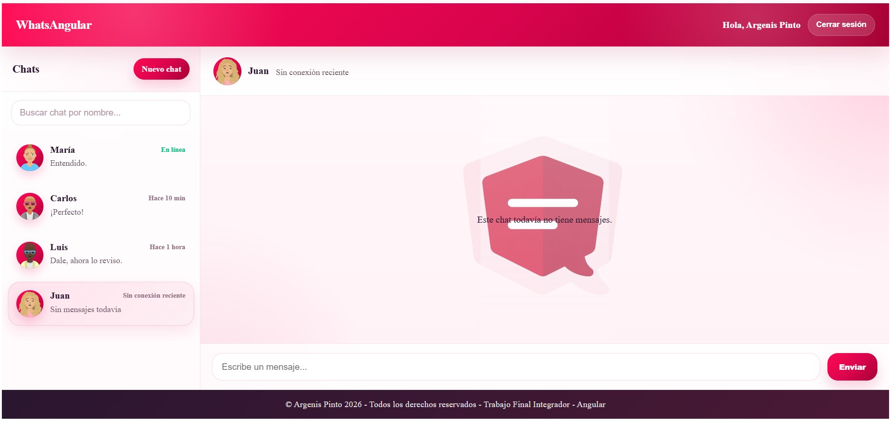
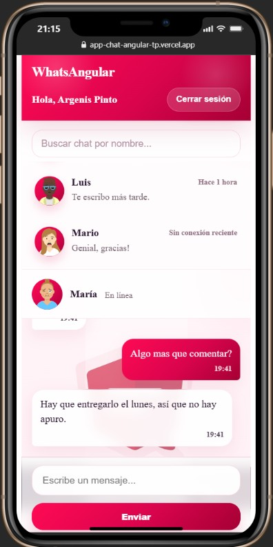

# Trabajo Final Integrador — Aplicación de Chat (Angular)

## 📌 Descripción

Este proyecto fue desarrollado como **Trabajo Final Integrador** del curso **Desarrollo en Angular**.

La aplicación consiste en un **sistema de chat simple** que permite:

- Autenticación básica de usuario
- Crear nuevos chats
- Buscar chats por nombre
- Enviar mensajes dentro de un chat
- Simulación de respuesta automática
- Persistencia de datos usando **LocalStorage**
- Interfaz moderna con **CSS, gradientes y animaciones**

La aplicación fue desarrollada siguiendo los conceptos aprendidos durante los módulos del curso, utilizando **Angular Standalone Components**, **Services**, **Guards**, **Pipes personalizados** y **Directivas modernas de Angular**.

---

# 🚀 Tecnologías utilizadas

- Angular CLI
- Angular Standalone Components
- Angular Signals
- Angular Router
- Guards de autenticación
- Pipes personalizados
- TypeScript
- HTML5
- CSS3
- LocalStorage

---

# 🧠 Funcionalidades principales

### 🔐 Login de usuario

La aplicación incluye una pantalla de login simple que permite acceder al sistema de chats.

Se utiliza:

- Formulario reactivo
- Validaciones básicas
- Persistencia de sesión en **LocalStorage**
- **AuthGuard** para proteger las rutas privadas.

---

### 💬 Gestión de Chats

El usuario puede:

- Crear nuevos chats
- Visualizar chats existentes
- Buscar chats por nombre
- Ver el estado del usuario (online/offline)
- Ver la última actividad del chat

Los chats se guardan en **LocalStorage** para mantener la persistencia.

---

### ✉️ Envío de mensajes

Dentro de cada chat se pueden enviar mensajes.

Funcionalidades:

- Mensajes del usuario
- Simulación de respuesta automática
- Visualización del historial de mensajes
- Auto‑scroll al último mensaje

---

### 🎨 Interfaz moderna

La interfaz del chat incluye:

- Gradientes personalizados
- Animaciones suaves
- Avatares automáticos generados a partir del nombre
- Layout responsive
- Buscador dinámico de chats

---

# 🗂️ Estructura del proyecto

```
chat-angular-final/
│
├── public/
│   ├── favicon-chat-tp.png
│   ├── favicon.ico
│   └── marketing-login.png
│
├── src/
│   ├── app/
│   │   ├── components/
│   │   │   ├── chat-list/
│   │   │   │   ├── chat-list.css
│   │   │   │   ├── chat-list.html
│   │   │   │   ├── chat-list.spec.ts
│   │   │   │   └── chat-list.ts
│   │   │   │
│   │   │   ├── chat-window/
│   │   │   │   ├── chat-window.css
│   │   │   │   ├── chat-window.html
│   │   │   │   ├── chat-window.spec.ts
│   │   │   │   └── chat-window.ts
│   │   │   │
│   │   │   ├── header/
│   │   │   │   ├── header.css
│   │   │   │   ├── header.html
│   │   │   │   ├── header.spec.ts
│   │   │   │   └── header.ts
│   │   │   │
│   │   │   ├── footer/
│   │   │   │   ├── footer.css
│   │   │   │   ├── footer.html
│   │   │   │   ├── footer.spec.ts
│   │   │   │   └── footer.ts
│   │   │   │
│   │   │   ├── form/
│   │   │   │   ├── form.css
│   │   │   │   ├── form.html
│   │   │   │   ├── form.spec.ts
│   │   │   │   └── form.ts
│   │   │   │
│   │   │   ├── message-form/
│   │   │   │   ├── message-form.css
│   │   │   │   ├── message-form.html
│   │   │   │   ├── message-form.spec.ts
│   │   │   │   └── message-form.ts
│   │   │   │
│   │   │   └── new-chat-form/
│   │   │       ├── new-chat-form.css
│   │   │       ├── new-chat-form.html
│   │   │       ├── new-chat-form.spec.ts
│   │   │       └── new-chat-form.ts
│   │   │
│   │   ├── guards/
│   │   │   └── auth.guard.ts
│   │   │
│   │   ├── interfaces/
│   │   │   ├── chat.interface.ts
│   │   │   ├── message.interface.ts
│   │   │   └── user-session.interface.ts
│   │   │
│   │   ├── pipes/
│   │   │   └── chat-status.pipe.ts
│   │   │
│   │   ├── services/
│   │   │   ├── auth.service.ts
│   │   │   └── chat.service.ts
│   │   │
│   │   ├── views/
│   │   │   ├── home/
│   │   │   │   ├── home.css
│   │   │   │   ├── home.html
│   │   │   │   ├── home.spec.ts
│   │   │   │   └── home.ts
│   │   │   │
│   │   │   ├── login/
│   │   │   │   ├── login.css
│   │   │   │   ├── login.html
│   │   │   │   ├── login.spec.ts
│   │   │   │   └── login.ts
│   │   │   │
│   │   │   └── new-chat/
│   │   │       ├── new-chat.css
│   │   │       ├── new-chat.html
│   │   │       ├── new-chat.spec.ts
│   │   │       └── new-chat.ts
│   │   │
│   │   ├── app.config.ts
│   │   ├── app.routes.ts
│   │   ├── app.spec.ts
│   │   ├── app.ts
│   │   ├── app.html
│   │   └── app.css
│   │
│   ├── assets/
│   │   ├── chat-interface.jpg
│   │   ├── login-view.jpg
│   │   ├── mobile-mode.jpg
│   │   ├── new-chat-created.jpg
│   │   ├── new-chat.jpg
│   │   └── search-chat.jpg
│   │
│   ├── index.html
│   ├── main.ts
│   └── styles.css
│
├── angular.json
├── package.json
└── README.md
```

---

# 🖼️ Capturas de pantalla

### 🔐 Pantalla de Login



### 💬 Interfaz principal de chat



### 🔎 Búsqueda de chats



### ➕ Creación de un nuevo chat



### 🟢 Chat creado



### 📱 Modo mobile



---

# ⚙️ Instalación y ejecución

## 1️⃣ Clonar el repositorio

```
git clone https://github.com/argenisjpinto/app-chat-angular-tp.git
```

## 2️⃣ Instalar dependencias

```
npm install
```

## 3️⃣ Ejecutar la aplicación

```
ng serve
```

Abrir en el navegador:

```
http://localhost:4200
```

---

# 👨‍🎓 Autor

**Argenis Pinto**  
Curso: Desarrollo en Angular  
Trabajo Final Integrador  
UTN — Centro de e‑Learning

---

# 📚 Bibliografía

Angular Documentation  
https://angular.dev

Angular Router Guide  
https://angular.dev/guide/routing

Angular Forms Guide  
https://angular.dev/guide/forms